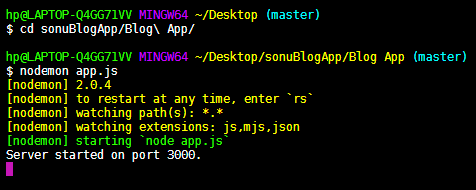

## **Blog App  with login authentication (normal + Google)**

## Prerequisites / Dependencies
"body-parser": "^1.18.3",
    "dotenv": "^6.2.0",
    "ejs": "^2.6.1",
    "express": "^4.16.4",
    "express-session": "^1.15.6",
    "mongoose": "^5.4.5",
    "mongoose-findorcreate": "^3.0.0",
    "passport": "^0.4.0",
    "passport-google-oauth20": "^1.0.0",
    "passport-local": "^1.0.0",
    "passport-local-mongoose": "^5.0.1"
**Used MongoDb for database and NodeJs to run app on local server**
    
## How to run on local server    

## Home page of app

## Register Page
Developed a secure login process which involved Bcrypt and salt rounds along with help of Passport or a simple Google authentication to enter
into the “/blog” page

## Write & Submit your blog

## View your Blogs 

